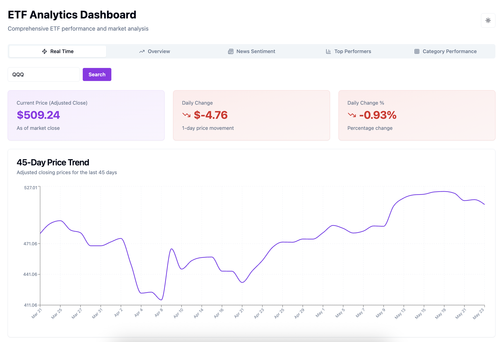

# ETF Analytics Dashboard



A modern, interactive dashboard for analyzing Exchange-Traded Funds (ETFs) performance, market trends, and sentiment analysis. Built with Next.js, TypeScript, and Tailwind CSS, this dashboard provides comprehensive insights into the ETF market with a focus on professional UX, mobile responsiveness, and dark mode support.

[](https://v0-data-dashboard-design-iota.vercel.app/)

## Features

### Overview
- Total ETF Trading Volume tracking
- Median 3-Year and 5-Year Returns analysis (with outlier filtering)
- Dividend Yield Distribution visualization (responsive, readable bins)
- Trailing P/E Ratio Distribution analysis

### News Sentiment Analysis
- Topic-based sentiment analysis with real-time news
- Individual ETF sentiment tracking
- Real-time sentiment scoring (-1 to +1)
- Visual sentiment indicators and badges
- Caching and rate limit handling for API usage

### Real-Time Data
- Live ETF price tracking (via Twelve Data API)
- Daily price changes and percentage movements
- 45-day historical price charts
- Searchable ETF selection
- Local storage caching for performance

### Top Performers
- Top 20 ETFs by 3-Year Returns, 5-Year Returns, and Dividend Yields
- Interactive, category-filtered performance charts

### Category Performance
- Sector-wise performance analysis
- Category-based asset distribution
- 3-Year and 5-Year category returns
- Combined performance metrics
- Responsive chart layouts and dropdowns

### User Experience & Design
- **Mobile Responsive:** All layouts, charts, and controls adapt to mobile screens. Tab bar uses only icons on mobile, dropdowns are repositioned for clarity, and chart labels are optimized for readability.
- **Dark Mode:** Seamless dark/light theme switching with persistent user preference.
- **Professional UI:** Built with shadcn/ui and Tailwind CSS for a modern, accessible, and consistent look.
- **Performance:** Local storage caching for API data, optimized rendering, and error handling.

## Data Sources

- **ETF Data:** Yahoo Finance (yfinance, local CSV)
- **Real-time Data:** Twelve Data API
- **News Sentiment:** Alpha Vantage API

## Dataset Information

The dashboard analyzes data from 4,148 ETFs, including the following key metrics:

- Symbol and Long Name
- Category and Fund Family
- Total Assets and Net Assets
- Market Cap and Volume
- Average Volume
- Price Metrics (NAV, Previous Close, Open)
- Performance Metrics (3-Year and 5-Year Average Returns)
- Valuation Metrics (Trailing PE, Forward PE)
- Dividend Information (Yield, Last Dividend Value)

## Tech Stack

- **Frontend Framework:** Next.js 14
- **Language:** TypeScript
- **Styling:** Tailwind CSS
- **Charts:** Recharts
- **UI Components:** shadcn/ui
- **State Management:** React Hooks
- **Data Fetching:** Native Fetch API
- **Data Collection:** Python (yfinance, pandas)

## Getting Started

1. Clone the repository:
```bash
git clone https://github.com/yourusername/etf-dashboard.git
```

2. Install dependencies:
```bash
pnpm install
```

3. Set up environment variables:
```bash
cp .env.example .env.local
```
Add your API keys to `.env.local`:
```
NEXT_PUBLIC_ALPHA_VANTAGE_API_KEY=your_alpha_vantage_api_key_here
NEXT_PUBLIC_TWELVE_DATA_API_KEY=your_twelve_data_api_key_here
```

4. Run the development server:
```bash
pnpm dev
```

5. Open [http://localhost:3000](http://localhost:3000) in your browser.

## API Keys Required

- Alpha Vantage API key for news sentiment analysis
- Twelve Data API key for real-time price data
- Yahoo Finance API (no key required for local CSV)

## Contributing

Contributions are welcome! Please feel free to submit a Pull Request for improvements, bug fixes, or new features.

## License

This project is licensed under the MIT License - see the LICENSE file for details.